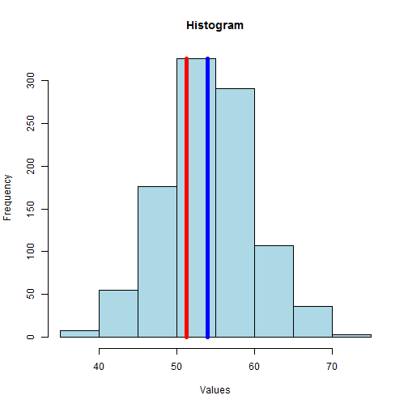

Data set mean guessing game
========================================================
author: Attila Vamos
date: 02/10/2016
URL to Shiny application:

https://attila-vamos.shinyapps.io/Data_Product_Project/

The aims of the Shiny application
========================================================

The main aim behind this application was to learn how to develop Shiny application, how to create, use and update input elements and how to handle input data in server code.

The Data set mean guessing game interactively displays a histogram of randomly generated standard deviation data and provide controls to the user to:

- guess the mean with a slider
- checking the guessed value
- generate a new data set and histogram to a game

Guessed value display and checking
========================================================
The guessed value is interactively (controlled by the slider) displayed on the histogram with a red vertical line

User can check the guess with a click on the "Check my guess" button and the app will:   
- show the real mean with a blue vertical line
- display the real value in a text box 
- calculate and display the MSE (Mean Square Error) value with the guessed and real mean

Generating a new data set and enabling a new guess
========================================================

To generate a new data set and histogram for the next try, the user can click on the "Next histogram" button. 

The app will:
- generates parameters (mean, sd) and a new data set
- determine the min, max values and randomly generate a new "first guess" value
- update the slider based on the new min, max and "first guess"values

Histogram with guessed (red) and real mean (blue)
=======================

